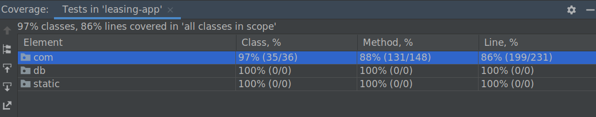

# Leasing App
## Requirements
* Java 11
* Docker
* docker-compose
* NodeJs:v16.14.0
* npm:8.3.1
* `npm install -g @angular/cli`

## Build and Run

* `docker-compose up`
* `./gradlew clean build bootRun`

## Swagger API specification
* In order to check the API documentation through Swagger UI:
http://localhost:8080/swagger-ui/index.html

## Add some vehicles, customers and contracts

```
curl -X POST \
http://localhost:8080/api/vehicles \
-H 'cache-control: no-cache' \
-H 'content-type: application/json' \
-H 'postman-token: 44633a93-b09b-f4ae-8f0c-ec005abf280d' \
-d '{
    "price": 200,
    "modelYear": 2022,
    "model": "X2",
    "brand": "BMW",
    "vin": "vin12429052485429"
}'

curl -X POST \
  http://localhost:8080/api/vehicles \
  -H 'cache-control: no-cache' \
  -H 'content-type: application/json' \
  -H 'postman-token: 53c2e2c2-4c23-e5b4-6939-3d9c98eade32' \
  -d '{
    "price": 10,
    "modelYear": 2020,
    "model": "X1",
    "brand": "BMW"
}'

curl -X POST \
  http://localhost:8080/api/customers \
  -H 'cache-control: no-cache' \
  -H 'content-type: application/json' \
  -H 'postman-token: d8a3d578-b3b9-fb9b-a538-a0c30ff22e8b' \
  -d '{
    "firstName": "John",
    "lastName": "Doe",
    "birthdate": "1989-09-11"
}'

curl -X POST \
  http://localhost:8080/api/customers \
  -H 'cache-control: no-cache' \
  -H 'content-type: application/json' \
  -H 'postman-token: d0b29c98-5d53-b303-f825-0c368bf931f2' \
  -d '{
    "firstName": "Philip",
    "lastName": "sous",
    "birthdate": "1986-11-16"
}'

curl -X POST \
  http://localhost:8080/api/contracts \
  -H 'cache-control: no-cache' \
  -H 'content-type: application/json' \
  -H 'postman-token: 669bab7e-8e14-1a1c-b30a-45283f41cf51' \
  -d '{
    "contractNumber": "54612154464",
    "monthlyRate": 1230.30,
    "vehicle": {
      "vehicleId": 1,
      "vehicleTypeId": 2,
      "brand": "BMW",
      "model": "X2",
      "modelYear": 2022,
      "vin": "vin12429052485429",
      "price": 200
    },
    "customer": {
      "customerId": 1,
      "firstName": "John",
      "lastName": "Doe",
      "birthdate": "1989-09-11"
    }
}'

curl -X POST \
  http://localhost:8080/api/contracts \
  -H 'cache-control: no-cache' \
  -H 'content-type: application/json' \
  -H 'postman-token: 669bab7e-8e14-1a1c-b30a-45283f41cf51' \
  -d '{
    "contractNumber": "2342343224",
    "monthlyRate": 54654.00,
    "vehicle": {
      "vehicleId": 2,
      "vehicleTypeId": 1,
      "brand": "BMW",
      "model": "X1",
      "modelYear": 2020,
      "vin": null,
      "price": 10
    },
    "customer": {
      "customerId": 2,
      "firstName": "Philip",
      "lastName": "sous",
      "birthdate": "1986-11-16"
    }
}'
```

## Visit the App
http://localhost:8080/

## Visit the App in the cloud
https://leasingapp.herokuapp.com/

https://leasingapp.herokuapp.com/swagger-ui/index.html

## Code Coverage



## TODOS
* There are pending tasks and bugs.
* The frontend is still missing some features such as
  adding entities and changing vehicles and customers in contract details.

## Commit Message
In this project we follow this commit message guideline: https://cbea.ms/git-commit/